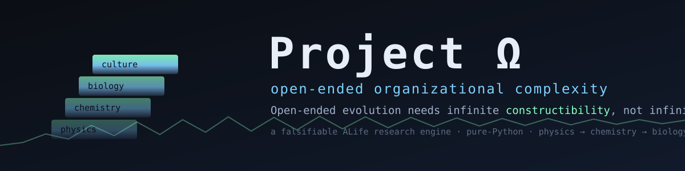

<p align="center">
  
</p>

<p align="center">
  <a href="#quickstart"></a>
  
  
  
</p>

# Project Ω (Omega)

**A falsifiable research engine for open-ended organizational complexity** — testing one hypothesis:

> **Open-ended evolution does not require infinite space. It requires infinite _constructibility_.**

Most artificial-life worlds are hand-authored and therefore finite: they eventually run out of
new things. Ω asks the opposite question — *what minimal substrate lets a world keep building
genuinely new organization forever, with nothing designed in advance?* — and answers it as a
lab notebook: every claim is a yes/no question against a matched control, and **retracted claims
and negative results are kept on purpose** (that is what makes it science, not a demo).

Everything is an **Organization** — a persistent arrangement of interacting differences. Space,
time, matter, and life are *not* primitives; if they appear, they must appear *as* organizations.
The only fixed laws are identity, consistency, causality, and conservation of distinguishability.

---

## The one result, in one line

Feeding persistent structure back as new primitives — growing *constructibility* while the
material is unchanged — turns a world that closes into one that stays open **forever**, and that
open+modular substrate lets collectives become **reproducible individuals** that stack into a
**tower of organizational levels**:

```
                              ╭──────────────╮  ← each tier's heritable collectives
             culture          │  culture     │    become the next tier's atoms
                ▲             ╭┴──────────────┤    (reification across levels)
             biology          │  biology      │
                ▲            ╭┴───────────────┤   novelty rate  ▁▂▃▄▅▆▇█▇▆▇█▇█  (never → 0)
            chemistry         │  chemistry     │   heredity      self ≫ null (reproducible)
                ▲           ╭┴────────────────┤   depth         no ceiling found (compute-limited)
             physics  ─────► │  physics (kernel)│
                              ╰────────────────╯
     "constructibility, not space"        one recursive engine
```

## Key results

Each row is a falsifiable experiment (or milestone) with a matched control. Full detail in
[`omega/docs/RESEARCH_LOG.md`](omega/docs/RESEARCH_LOG.md); the per-experiment table is in
[`omega/docs/README.md`](omega/docs/README.md).

| # | Question | Result |
|---|----------|--------|
| **Ω-0.2** reification | Can a bounded material stay open-ended? | **Yes** — promoting persistent structure to *new primitives* keeps the possibility space growing; the matched control (no reification) freezes. |
| **Ω-0.15** collective individuality | Can a collective become a *reproducible individual*? | **Yes, in miniature** — a substrate that is **modular _and_ open-ended** (variable-length type paths) reaches the "both corner": strong reproducible heredity **and** sustained novelty. |
| **Ω-0.16** levels of organization | Does the transition *recurse*? | **Yes** — each tier's heritable collectives become the next tier's atoms: physics → chemistry → biology → culture from **one engine**. |
| **Ω-0.17** unboundedness | Does it persist over 10⁵ ticks / keep climbing? | **Affirmative in miniature** — heredity flat & novelty > 0 to 120k ticks; no intrinsic tower-depth ceiling found. |
| **Ω-0.31** settling openness | Is the long-run novelty *real*, or an eviction-window artifact? | **A genuine positive floor — with an honest correction.** A fixed-memory global-novelty sketch (counts each class once *ever*) shows the open engine still discovers never-before-seen classes at **~0.13/tick at 300k ticks, 3 seeds**, decisively above the closed control's exact **0**. But the previously-reported *flat* rate was **~4× inflated** by eviction recycling; the true genuine rate is **positive but slowly declining** (halves over 300k). Claim confirmed, overclaim retired. |
| **Ω-0.20** sustained novelty | Does open-endedness need *continuing* construction? | **Yes** — a one-time alphabet bump still closes; only *ongoing* reification holds the novelty rate. Constructibility is a **rate, not a stock**. |
| **Ω-0.21** scaling | Can it run at 10⁶ ticks? | Bounded-memory mode + a **3× faster** kernel, validated against known results — the "in-miniature" cap lifted. |
| **Ω-0.22–23** the living world | Can you *watch* it? | A persistent, checkpointing **world** with a live dashboard: named lifeforms, cultures, a novelty pulse, geography, and the ability to reach in and steer it. |
| **Ω-0.24–34** toward minds | Can collectives become self-improving? | **A precise, honest arc that keeps naming the next barrier.** exp039 pinned collective heredity → **exp040 broke that ceiling** (self ≈ 0.56, world still open); **exp041/042** showed a higher heredity level and even a *self-expanding* scalar objective don't compound → barrier is **goal representation**. **exp044** supplies it (a heritable, composable target *path*) and gets the arc's first over-generations *deepening* — but *transient* and without lifting competence → barrier is **credit assignment**. **exp045** tries the direct fix (aim the goal at the deme's own closure core) — **still no compounding, slightly worse**: alignment moves the goal's *direction* but not the *selection pressure*, so **credit assignment is a representation problem** (it must live in the *fitness*, not the goal). Next: **exp046**. |

*(Kept honestly: exp003 was a retracted false positive; exp009/010/011/018–020/028/036 are
informative **negatives**. The program is organized against closure, not for hype.)*

## Watch a world live

```bash
python -m omega.world run --dashboard          # live browser dashboard at localhost:8000
python -m omega.world run --checkpoint w.ckpt  # a world that persists across restarts
python -m omega.world snapshot --out world.html # a self-contained HTML snapshot
```

You'll see the **novelty pulse** (open-endedness made visible), a roster of **named lifeforms**
with real ages, transient **collective communities**, the growing constructed alphabet, cultural
transmission, a **world map**, and a "reach in" panel to seed life, trigger extinctions, or tune
the laws while it runs. See [`omega/docs/WORLD.md`](omega/docs/WORLD.md).

## Quickstart

Pure **Python 3.10+**, **standard library only — no dependencies to install.**

```bash
git clone https://github.com/homeo-x/alife && cd alife
python -m omega.cli list                    # list experiments
python -m omega.cli run exp030 --seed 0     # a completed transition to collective individuality
python -m omega.cli run exp002 --set bind=false   # a matched control
python -m unittest discover -s omega/tests  # run the test suite (73 tests)
```

More runnable one-liners are in [`examples/`](examples/).

## Why it matters

- **Open-ended evolution** is a central unsolved problem in ALife: real biology keeps inventing;
  our simulations almost always stall. Ω isolates *why*, and shows one mechanism that doesn't.
- **Major evolutionary transitions** (genes → cells → organisms → societies) are re-derived here
  as a single recursive move — and the exact substrate condition that enables them is measured.
- **Honest AI-relevance**: the self-improvement arc (Ω-0.24–34) asks whether evolved collectives
  could become mind-like, and answers with a *specific, quantified blocker* rather than hype.

## Repository map

```
omega/kernel/       the immutable core: organizations, conservation, reactions, the universe
omega/experiments/  the physics plugins — every experiment as a gated mode (byte-identical when off)
omega/levels/       the recursive level tower (physics → chemistry → biology → culture)
omega/world/        the persistent, watchable, steerable world (runtime, checkpoint, dashboard)
omega/emergence/    novelty / construction / persistence trackers (the anti-closure signals)
omega/metrics/      open-endedness index and organization metrics
omega/docs/         the science: README (per-experiment), RESEARCH_LOG, ARCHITECTURE, LEVELS, WORLD, SCALING
studies/            one matched-control study + findings (EXP0NN_FINDINGS.md) per experiment
docs/               presentation: this banner, ROADMAP, CONTRIBUTING
```

## Status & roadmap

**Status:** the constructibility hypothesis is confirmed *in miniature* and consolidated; a
living world exists; the self-improvement question is answered with a located blocker. Full
history in [`omega/docs/RESEARCH_LOG.md`](omega/docs/RESEARCH_LOG.md) (milestones Ω-0.1 → Ω-0.34).

**Next frontier** (see [`docs/ROADMAP.md`](docs/ROADMAP.md)): an **open-ended, self-expanding
objective** — collective-level reification of *goals* (the analogue of substrate-level reification
of *primitives*). exp040 broke the heredity ceiling and exp041 showed that a higher heredity *level*
is still not enough: under a **fixed** objective competence erodes rather than ratchets, so the
target itself must keep growing.

## License

MIT — see [`LICENSE`](LICENSE). Contributions welcome; please read
[`docs/CONTRIBUTING.md`](docs/CONTRIBUTING.md) (the falsifiable, gated, byte-identical discipline
is the whole point).
